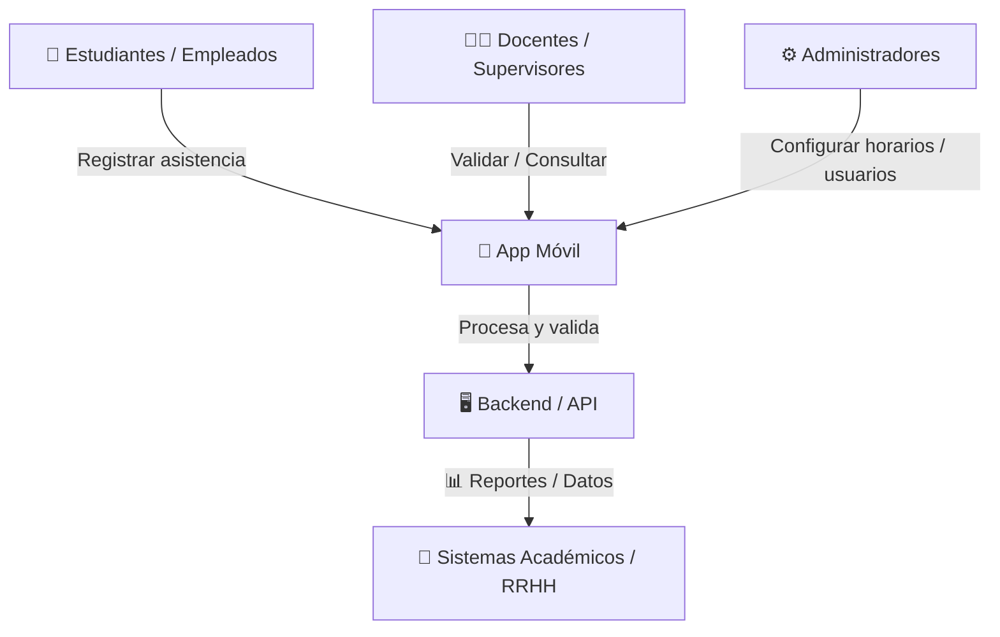
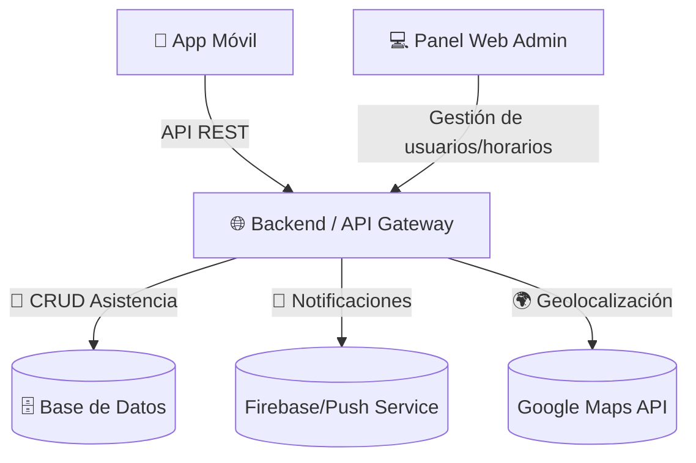

   !(/docs/images/arc42-logo.png)

**Acerca de arc42**

arc42, La plantilla de documentación para arquitectura de sistemas y de
software.

Por Dr. Gernot Starke, Dr. Peter Hruschka y otros contribuyentes.

Revisión de la plantilla: 7.0 ES (basada en asciidoc), Enero 2017

© Reconocemos que este documento utiliza material de la plantilla de
arquitectura arc42, <https://www.arc42.org>. Creada por Dr. Peter
Hruschka y Dr. Gernot Starke.

# Introducción y Metas

## Vista de Requerimientos

### Actores principales
- **Estudiantes / Empleados** → Registran su asistencia.
- **Docentes / Jefes / Supervisores** → Validan, consultan reportes y gestionan asistencia.  
- **Administradores** → Configuran horarios, grupos, usuarios y reglas.  
- **Sistema (API / Backend)** → Valida, procesa y guarda los datos.

### Requerimientos Funcionales
1. **Registro de asistencia**
   - Marcar entrada y salida desde la app.  
   - Validación por red Wi-Fi institucional.  
   - Escaneo QR en el aula/empresa.  

2. **Autenticación y autorización**
   - Login seguro con usuario/contraseña o SSO (Google/Microsoft).  
   - Roles: estudiante/empleado, docente/supervisor, administrador.  

3. **Reportes y consultas**
   - Historial de asistencia individual.  
   - Reportes por curso, grupo, departamento o periodo.  
   - Exportación a Excel/PDF.  

4. **Notificaciones**
   - Alertas push para recordar marcar asistencia.  
   - Notificaciones de inasistencias o retrasos.  

5. **Integraciones**
   - API REST para conexión con sistemas académicos.  
   - Panel web admin para gestión centralizada.  

### Requerimientos No Funcionales
1. **Disponibilidad**  
   - App y backend accesibles 24/7, con redundancia en servidores críticos.  

2. **Escalabilidad**  
   - Soporte para miles de usuarios concurrentes (universidades/empresas grandes).  

3. **Seguridad**  
   - Comunicación cifrada (HTTPS + TLS).  
   - Tokens JWT / OAuth2 para sesiones seguras.  
   - Protección de datos personales (GDPR / Habeas Data).  

4. **Rendimiento**  
   - Tiempo de respuesta < 2 segundos en operaciones comunes.  
   - Manejo eficiente de reportes masivos.  

5. **Portabilidad**  
   - App disponible en **Android** y **iOS**.  
   - Versión web opcional, compatible con navegadores modernos.  

6. **Usabilidad**  
   - Interfaz intuitiva, multilenguaje.  
   - Accesible según normas WCAG.  

7. **Mantenibilidad**  
   - Código modular (Clean Architecture en app, microservicios en backend).  
   - Documentación clara para integraciones.

### Componentes de Arquitectura (Alto Nivel)
- **App móvil (Flutter)**
  → UI, autenticación,  escaneo QR, notificaciones.  

- **API Gateway / Backend (ORACLE Apex)**  
  → Autenticación, lógica de negocio, validación de asistencia, conexión con DB.

- **Base de datos (Oracle Database)**  
  → Usuarios, horarios, registros de asistencia.  

- **Módulo de analítica y reportes**  
  → Generación de reportes, estadísticas

## Metas de Calidad

### 1. Disponibilidad  
- Garantizar **99.5% de disponibilidad** del sistema (24/7).  

### 2. Escalabilidad  
- Soportar al menos **5.000 usuarios concurrentes** en la fase inicial.  

### 3. Seguridad  
- Toda la comunicación cifrada bajo **HTTPS + TLS 1.3**.  
- Uso de **JWT / OAuth2** para autenticación segura.  
- Cumplimiento de normativas de protección de datos (**GDPR / Habeas Data**).  

### 4. Rendimiento  
- Tiempo de respuesta promedio: **< 2 segundos** en operaciones de registro y consulta.  
- Procesamiento de reportes masivos en menos de **30 segundos**.  

### 5. Portabilidad  
- Aplicación disponible en **Android** y **iOS**.  

### 6. Usabilidad  
- Interfaz intuitiva con curva de aprendizaje de máximo **10 minutos** para nuevos usuarios.  
- Soporte **multilenguaje (mínimo: Español e Inglés)**.  
- Cumplimiento de normas **WCAG 2.1** para accesibilidad.  

### 7. Mantenibilidad  
- Arquitectura modular con separación de capas (**Clean Architecture / Microservicios**).  
- Documentación técnica disponible y actualizada en repositorio.  
- Tasa de resolución de incidencias críticas en **< 48 horas**.  

### 8. Confiabilidad  
- El sistema debe garantizar que **el 99% de los registros de asistencia** sean procesados sin pérdida de datos.  
- Mecanismos de respaldo automático de la base de datos cada **24 horas**.  

## Partes interesadas (Stakeholders)

| Rol       | Nombre completo                  | Contacto | Expectativas |
|-----------|----------------------------------|----------|--------------|
| Profesor Titular | Jairo Enrique Serrano Castañeda  | [jserrano@utb.edu.co](mailto:jserrano@utb.edu.co) | Que la arquitectura de la API se integre eficientemente con la aplicación móvil, asegurando escalabilidad, seguridad y un rendimiento óptimo en dispositivos nativos. |
| Ingeniero de Desarrollo TIC | Elian Andres Vega Hernandez      | [vegae@utb.edu.co](mailto:vegae@utb.edu.co) | Que la aplicación móvil facilite el acceso a los registros de asistencia de manera confiable y en tiempo real |

---

# Restricciones de la Arquitectura 
## Restricciones Tecnológicas  
- La app debe desarrollarse en **Flutter** para asegurar compatibilidad en Android e iOS.  
- El backend debe implementarse en **ORACLE Apex**, priorizando escalabilidad y modularidad.  
- La base de datos debe ser **Oracle**, con **Redis** como caché para optimizar el rendimiento.  
- Toda comunicación debe realizarse mediante **HTTPS/TLS**.  

## Restricciones Operativas  
- El sistema debe estar disponible **24/7**, con un máximo de **3 horas de inactividad mensual**.  
- Los registros de asistencia deben conservarse por un período mínimo de **2 años**.  
- Solo se permiten integraciones con **APIs públicas y seguras**.  
- La aplicación debe funcionar en redes **3G, 4G, 5G y Wi-Fi**.  

## Restricciones Organizacionales  
- Cumplimiento estricto de normativas de protección de datos (**GDPR / Habeas Data**).  
- Acceso a funcionalidades restringido por **roles definidos** (estudiante/empleado, docente/supervisor, administrador).  
- Los reportes solo pueden ser consultados por **docentes, supervisores o administradores**.  
- La arquitectura de software debe seguir principios de **Clean Architecture** y **microservicios**.  

## Restricciones de Integración  
- El backend debe exponer un **API REST documentado con Swagger/OpenAPI**.  
- El consumo de la API debe limitarse a **1000 requests por minuto por usuario autenticado**.  
- Toda integración externa debe pasar por **módulos autorizados y controlados**.  

## Restricciones de Seguridad  
- La autenticación debe implementarse con **JWT u OAuth2**.  
- Los datos sensibles (contraseñas, tokens) deben almacenarse de forma **cifrada o hasheada (bcrypt, AES)**.  
- Todos los accesos deben estar controlados por **roles y permisos definidos**.   

---

# Alcance y Contexto del Sistema

## Alcance del Sistema  
El sistema de **Toma de Asistencia** tiene como objetivo principal **digitalizar y automatizar el control de asistencia** en instituciones educativas y organizaciones empresariales, reduciendo procesos manuales y mejorando la precisión en los registros.  

### Funcionalidades dentro del alcance  
- Registro de asistencia mediante **app móvil** (entrada y salida).  
- Validación de asistencia mediante **QR**.  
- **Autenticación segura** con usuario/contraseña o SSO (Google/Microsoft).  
- Gestión de **horarios, grupos, cursos, jornadas**.  
- Consulta y generación de **reportes individuales y grupales** en distintos formatos (Excel/PDF).  
- **Notificaciones push** para recordatorios, retrasos e inasistencias.  
- **Panel web administrativo** para gestión centralizada. 

### Funcionalidades fuera del alcance (MVP inicial)  
- Reconocimiento facial o biometría avanzada
- Inteligencia artificial para predicción de ausentismo.  
- Funcionalidades offline completas (solo cache limitado).  

## Contexto del Sistema  

### Actores principales  
- **Estudiantes / Empleados** → Registran su asistencia desde la app móvil.  
- **Docentes / Supervisores / Jefes** → Validan, consultan y gestionan asistencia.  
- **Administradores** → Configuran horarios, grupos y usuarios.  
- **Sistema (Backend + API)** → Procesa, valida y almacena la información de asistencia.  

### Interacciones con el entorno  
- **App móvil** (Android/iOS) → Punto de interacción principal para usuarios finales.  
- **Panel Web** → Para administradores y supervisores que gestionan y consultan datos.  
- **Base de datos centralizada** (Oracle) → Almacena usuarios, horarios y registros.

## Contexto de Negocio

El sistema de **Toma de Asistencia** busca digitalizar y automatizar el proceso de registro y control de asistencia en instituciones educativas y organizaciones.  
El modelo de negocio contempla tres tipos de actores principales:  

- **Estudiantes / Empleados**: registran su asistencia mediante la aplicación móvil, usando mecanismos como GPS, QR, NFC o Wi-Fi institucional.  
- **Docentes / Supervisores**: consultan y validan la asistencia en tiempo real desde la app móvil o un panel web.  
- **Administradores**: gestionan usuarios, horarios, grupos y reglas de asistencia a través de un panel web.  

Además, el sistema debe integrarse con **sistemas académicos y de recursos humanos**, permitiendo exportar registros y sincronizar información con otras plataformas.

## Contexto Técnico

El sistema se compone de los siguientes elementos:  

- **App Móvil (Android/iOS)**: punto de interacción principal para estudiantes y empleados, que permite el registro de asistencia y la consulta de historial.  
- **Panel Web**: herramienta administrativa para la gestión de usuarios, horarios y generación de reportes.  
- **Backend / API Gateway**: núcleo de la lógica de negocio, encargado de procesar registros, validar condiciones y exponer APIs REST seguras.  
- **Base de Datos SQL (Oracle)**: almacenamiento principal de usuarios, horarios y registros de asistencia.  
- **Redis**: soporte para cache y consultas rápidas.

### Mapeo de Entrada/Salida a Canales  

#### Entradas  
- Desde **App Móvil**: registro de asistencia (QR), login seguro.  
- Desde **Panel Web**: gestión de usuarios, horarios, grupos y reportes.  

#### Procesamiento  
- Validación de identidad y autenticación.  
- Aplicación de reglas de negocio (asistencia válida, tardanza, ausencia).  
- Almacenamiento en base de datos.  
- Uso de cache con Redis para optimizar consultas.  

#### Salidas  
- Hacia **App Móvil**: confirmación de asistencia registrada, historial individual y notificaciones push.  
- Hacia **Panel Web**: reportes en PDF/Excel, estadísticas y gestión de datos.  

# Estrategia de solución

# Vista de Bloques

## Sistema General de Caja Blanca

***\<Diagrama general>***

Motivación

:   *\<Explicación en texto>*

Bloques de construcción contenidos

:   *\<Desripción de los bloques de construcción contenidos (Cajas
    negras)>*

Interfases importantes

:   *\<Descripción de las interfases importantes>*

### \<Caja Negra 1>

*\<Propósito/Responsabilidad>*

*\<Interfase(s)>*

*\<(Opcional) Características de Calidad/Performance>*

*\<(Opcional) Ubicación Archivo/Directorio>*

*\<(Opcional) Requerimientos Satisfechos>*

*\<(Opcional) Riesgos/Problemas/Incidentes Abiertos>*

### \<Caja Negra 2>

*\<plantilla de caja negra>*

### \<Caja Negra N>

*\<Plantilla de caja negra>*

### \<Interfase 1>

...

### \<Interfase m>

## Nivel 2 {#_nivel_2}

### Caja Blanca *\<bloque de construcción 1>*

*\<plantilla de caja blanca>*

### Caja Blanca *\<bloque de construcción 2>*

*\<plantilla de caja blanca>*

...

### Caja Blanca *\<bloque de construcción m>*

*\<plantilla de caja blanca>*

## Nivel 3 {#_nivel_3}

### Caja Blanca \<\_bloque de construcción x.1\_\>

*\<plantilla de caja blanca>*

### Caja Blanca \<\_bloque de construcción x.2\_\>

*\<plantilla de caja blanca>*

### Caja Blanca \<\_bloque de construcción y.1\_\>

*\<plantilla de caja blanca>*

# Vista de Ejecución 

## \<Escenario de ejecución 1>

-   *\<Inserte un diagrama de ejecución o la descripción del escenario>*

-   *\<Inserte la descripción de aspectos notables de las interacciones
    entre los bloques de construcción mostrados en este diagrama.\>*

## \<Escenario de ejecución 2>

## ... {#_}

## \<Escenario de ejecución n>

# Vista de Despliegue

## Nivel de infraestructura 1

***\<Diagrama General>***

Motivación

:   *\<Explicación en forma textual>*

Características de Calidad/Rendimiento

:   *\<Explicación en forma textual>*

    Mapeo de los Bloques de Construcción a Infraestructura

    :   *\<Descripción del mapeo>*

## Nivel de Infraestructura 2

### *\<Elemento de Infraestructura 1>*

*\<diagrama + explicación>*

### *\<Elemento de Infraestructura 2>*

*\<diagrama + explicación>*

...

### *\<Elemento de Infraestructura n>*

*\<diagrama + explicación>*

# Conceptos Transversales (Cross-cutting)

## *\<Concepto 1>* {#__emphasis_concepto_1_emphasis}

*\<explicación>*

## *\<Concepto 2>* {#__emphasis_concepto_2_emphasis}

*\<explicación>*

...

## *\<Concepto n>* {#__emphasis_concepto_n_emphasis}

*\<explicación>*

# Decisiones de Diseño

# Requerimientos de Calidad

## Árbol de Calidad {#__rbol_de_calidad}

## Escenarios de calidad {#_escenarios_de_calidad}

# Riesgos y deuda técnica

# Glosario

| Término       | Definición      |
|---------------|-----------------|
| **<Término-1>** | *<definición-1>* |
| **<Término-2>** | *<definición-2>* |

