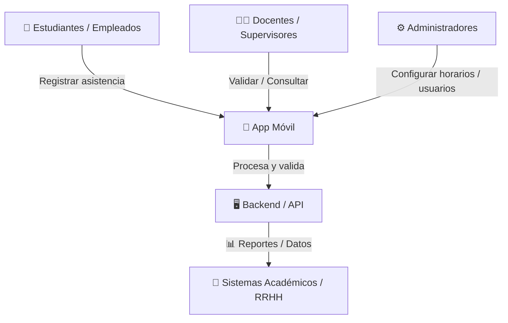
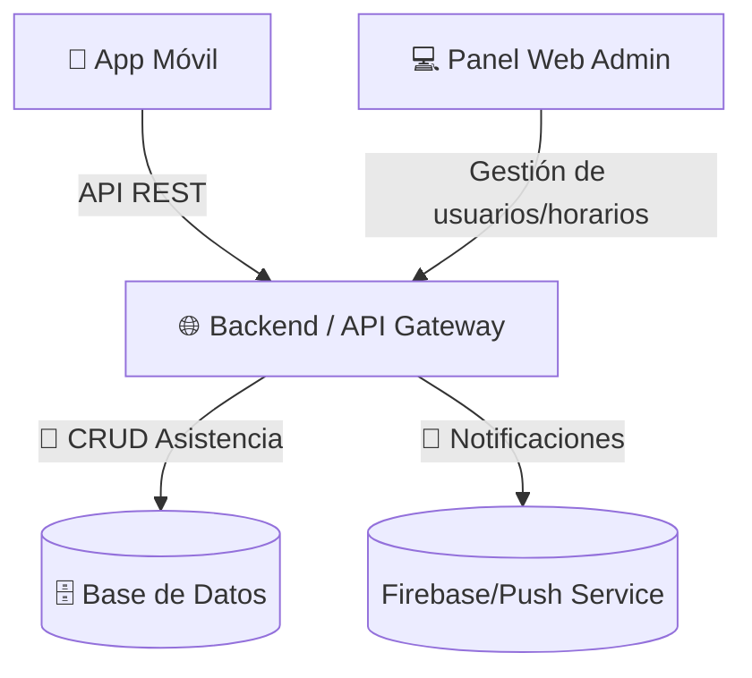
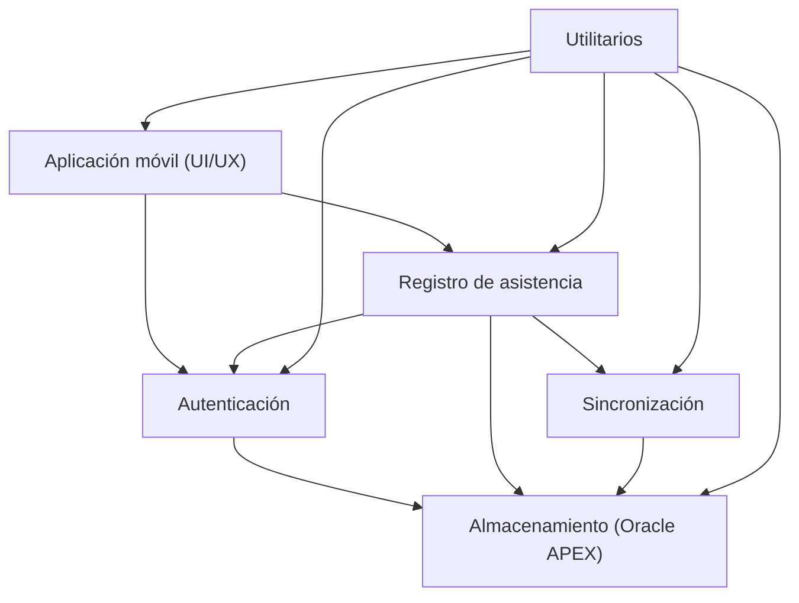
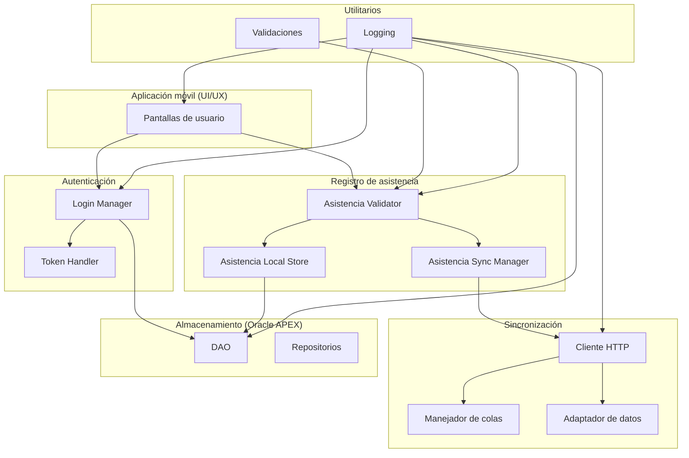
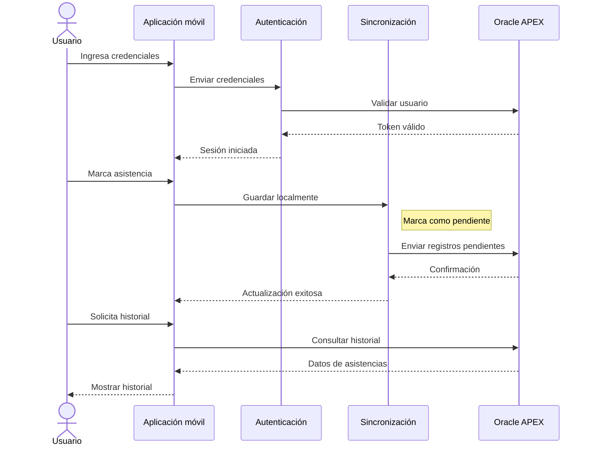
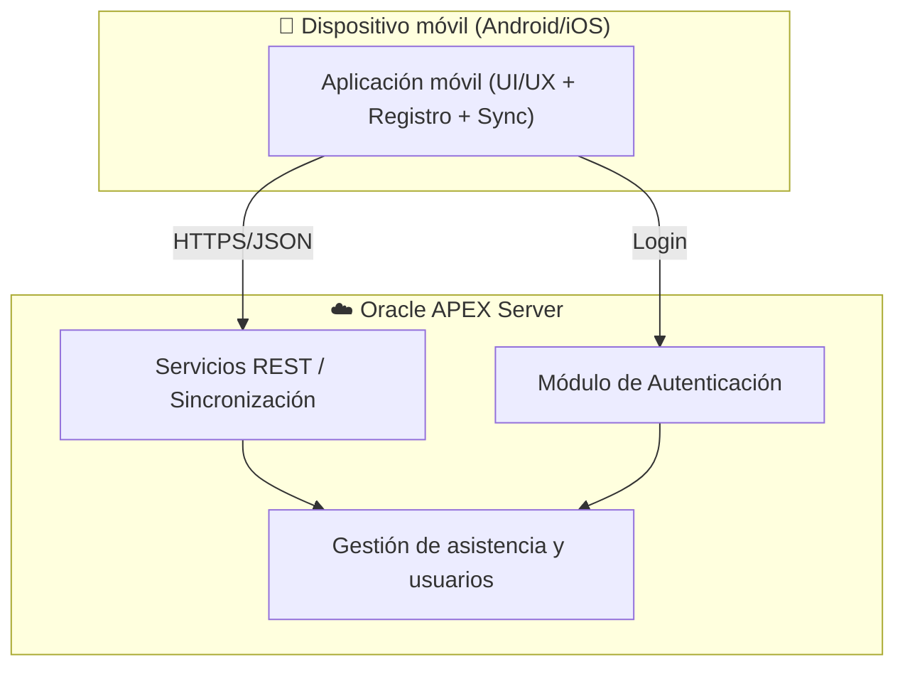

**Acerca de arc42**

arc42, La plantilla de documentación para arquitectura de sistemas y de
software.

Por Dr. Gernot Starke, Dr. Peter Hruschka y otros contribuyentes.

Revisión de la plantilla: 7.0 ES (basada en asciidoc), Enero 2017

© Reconocemos que este documento utiliza material de la plantilla de
arquitectura arc42, <https://www.arc42.org>. Creada por Dr. Peter
Hruschka y Dr. Gernot Starke.

# 1. Introducción y Metas

Este apartado describe los requisitos relevantes y las fuerzas impulsoras que los arquitectos de software y el equipo de desarrollo deben considerar. Incluye los **objetivos de negocio**, las **funcionalidades esenciales y requisitos funcionales del sistema**, los **objetivos de calidad de la arquitectura** y los **stakeholders con sus expectativas**. Estos serán los objetivos establecidos para este sistema:

| Priority | Descripción                                                                                                      |
|----------|------------------------------------------------------------------------------------------------------------------|
| 1        | Validar la funcionalidad básica de registro de asistencias desde una aplicación móvil con simplicidad y seguridad. |
| 2        | Resolver los problemas de procesos manuales que generan errores, retrasos y falta de información centralizada.    |
| 3        | Prevenir la suplantación o marcas falsas mediante validación de escaneo QR.                     |
| 4        | Permitir autenticación básica de usuarios, gestión mínima de usuarios y horarios.                                |
| 5        | Habilitar consultas de asistencia y generación de reportes simples en el backend.                                |
| 6        | Incluir notificaciones básicas de recordatorio y alertas por ausencias o retrasos.                               |
| 7        | Servir como base para recopilar retroalimentación de usuarios antes de escalar hacia una solución más robusta.   |

## 1.2 Vista de Requerimientos

### 1.2.1 Actores principales

- **Estudiantes / Empleados** → Registran su asistencia.
- **Docentes / Jefes / Supervisores** → Validan, consultan reportes y gestionan asistencia.  
- **Administradores** → Configuran horarios, grupos, usuarios y reglas.  
- **Sistema (API / Backend)** → Valida, procesa y guarda los datos.

### 1.2.2 Requerimientos Funcionales

| Id   | Requirement                 | Explanation                                                                 |
|------|-----------------------------|-----------------------------------------------------------------------------|
| RF1  | Registro de asistencia      | Permitir a los usuarios marcar entrada y salida desde la aplicación móvil. Validación por escaneo QR en el aula/empresa. |
| RF2  | Autenticación y autorización| Acceso seguro mediante usuario/contraseña o SSO (Microsoft). Manejo de roles: estudiante/empleado, docente/supervisor, administrador. |
| RF3  | Reportes y consultas        | Generar historial de asistencia individual y reportes por curso, grupo, departamento o periodo. Posibilidad de exportación a Excel/PDF. |
| RF4  | Notificaciones              | Enviar alertas push para recordar marcar asistencia y notificaciones de inasistencias o retrasos. |
| RF5  | Integraciones               | Proveer API REST para conexión con sistemas académicos y panel web de administración centralizada. |

---

### 1.2.3 Requerimientos No Funcionales

| Id   | Requirement       | Explanation                                                                 |
|------|------------------|-----------------------------------------------------------------------------|
| RNF1 | Disponibilidad   | El sistema debe estar disponible 24/7. Backend con redundancia en servidores críticos. |
| RNF2 | Escalabilidad    | Soporte para miles de usuarios concurrentes (ejemplo: universidades grandes). |
| RNF3 | Seguridad        | Comunicación cifrada (HTTPS + TLS). Tokens JWT / OAuth2. Cumplimiento de GDPR/Habeas Data. |
| RNF4 | Rendimiento      | Tiempo de respuesta < 2 segundos en operaciones comunes. Manejo eficiente de reportes masivos. |
| RNF5 | Portabilidad     | App disponible en Android e iOS. Versión web compatible con navegadores modernos. |
| RNF6 | Usabilidad       | Interfaz intuitiva, multilenguaje y accesible según normas WCAG. |
| RNF7 | Mantenibilidad   | Código modular (Clean Architecture, microservicios). Documentación clara para integraciones. |

### 1.2.4 Componentes de Arquitectura (Alto Nivel)

- **App móvil (Flutter)**
  → UI, autenticación,  escaneo QR, notificaciones.  

- **API Gateway / Backend (ORACLE Apex)**  
  → Autenticación, lógica de negocio, validación de asistencia, conexión con DB.

- **Base de datos (Oracle Database)**  
  → Usuarios, horarios, registros de asistencia.  

- **Módulo de analítica y reportes**  
  → Generación de reportes, estadísticas

## 1.3 Metas de Calidad

| ID    | Meta de Calidad | Descripción                                                                                          | Prioridad |
|-------|-----------------|------------------------------------------------------------------------------------------------------|-----------|
| 1.3.1 | Disponibilidad  | Garantizar **99.5% de disponibilidad** del sistema (24/7).                                           | Alta      |
| 1.3.2 | Escalabilidad   | Soportar al menos **5.000 usuarios concurrentes** en la fase inicial.                                | Alta      |
| 1.3.3 | Seguridad       | Comunicación cifrada con **HTTPS + TLS 1.3**. Autenticación con **JWT / OAuth2**. Cumplimiento de **GDPR / Habeas Data**. | Alta      |
| 1.3.4 | Rendimiento     | Tiempo de respuesta promedio **< 2 segundos** en registros y consultas. Reportes masivos en **< 30 segundos**. | Alta      |
| 1.3.5 | Portabilidad    | Aplicación disponible en **Android** y **iOS**.                                                      | Media     |
| 1.3.6 | Usabilidad      | Interfaz intuitiva, curva de aprendizaje **< 10 min**. Soporte **multilenguaje (ES/EN)**. Cumplimiento de **WCAG 2.1**. | Alta      |
| 1.3.7 | Mantenibilidad  | Arquitectura modular (**Clean Architecture / Microservicios**). Documentación técnica actualizada. | Media     |
| 1.3.8 | Confiabilidad   | Garantizar que el **99% de registros de asistencia** se procesen sin pérdida de datos. Respaldo automático de la base de datos cada **24h**. | Alta      |

## 1.4 Partes interesadas (Stakeholders)

| Rol       | Nombre completo                  | Contacto | Expectativas |
|-----------|----------------------------------|----------|--------------|
| Profesor Titular | Jairo Enrique Serrano Castañeda  | [jserrano@utb.edu.co](mailto:jserrano@utb.edu.co) | Que la arquitectura de la API se integre eficientemente con la aplicación móvil, asegurando escalabilidad, seguridad y un rendimiento óptimo en dispositivos nativos. |
| Ingeniero de Desarrollo TIC | Elian Andres Vega Hernandez      | [vegae@utb.edu.co](mailto:vegae@utb.edu.co) | Que la aplicación móvil facilite el acceso a los registros de asistencia de manera confiable y en tiempo real |

---

# 2. Restricciones de la Arquitectura

## 2.1 Restricciones Tecnológicas  

- La app debe desarrollarse en **Flutter** para asegurar compatibilidad en Android e iOS.  
- El backend debe implementarse en **ORACLE Apex**, priorizando escalabilidad y modularidad.  
- La base de datos debe ser **Oracle**, con **Redis** como caché para optimizar el rendimiento.  
- Toda comunicación debe realizarse mediante **HTTPS/TLS**.  

## 2.2 Restricciones Operativas

- El sistema debe estar disponible **24/7**, con un máximo de **3 horas de inactividad mensual**.  
- Los registros de asistencia deben conservarse por un período mínimo de **2 años**.  
- Solo se permiten integraciones con **APIs públicas y seguras**.  
- La aplicación debe funcionar en redes **Wi-Fi**.  

## 2.3 Restricciones Organizacionales

- Cumplimiento estricto de normativas de protección de datos (**GDPR / Habeas Data**).  
- Acceso a funcionalidades restringido por **roles definidos** (estudiante/empleado, docente/supervisor, administrador).  
- Los reportes solo pueden ser consultados por **docentes, supervisores o administradores**.  
- La arquitectura de software debe seguir principios de **Clean Architecture** y **microservicios**.  

## 2.4 Restricciones de Integración

- El backend debe exponer un **API REST documentado con Swagger/OpenAPI**.  
- El consumo de la API debe limitarse a **1000 requests por minuto por usuario autenticado**.  
- Toda integración externa debe pasar por **módulos autorizados y controlados**.  

## 2.5 Restricciones de Seguridad

- La autenticación debe implementarse con **JWT u OAuth2**.  
- Los datos sensibles (contraseñas, tokens) deben almacenarse de forma **cifrada o hasheada (bcrypt, AES)**.  
- Todos los accesos deben estar controlados por **roles y permisos definidos**.

---

# 3. Alcance y Contexto del Sistema

## 3.1 Alcance del Sistema

El sistema de **Control de Asistencia** tiene como objetivo principal **digitalizar y automatizar el control de asistencia** en instituciones educativas y organizaciones empresariales, reduciendo procesos manuales y mejorando la precisión en los registros.  

### 3.1.1 Funcionalidades dentro del alcance

- Registro de asistencia mediante **app móvil** (entrada y salida).  
- Validación de asistencia mediante **QR**.  
- **Autenticación segura** con usuario/contraseña o SSO (Google/Microsoft).  
- Gestión de **horarios, grupos, cursos, jornadas**.  
- Consulta y generación de **reportes individuales y grupales** en distintos formatos (Excel/PDF).  
- **Notificaciones push** para recordatorios, retrasos e inasistencias.  
- **Panel web administrativo** para gestión centralizada.

### 3.1.2 Funcionalidades fuera del alcance (MVP inicial)

- Reconocimiento facial o biometría avanzada
- Inteligencia artificial para predicción de ausentismo.  
- Funcionalidades offline completas (solo cache limitado).  

## 3.2 Contexto del Sistema  

### 3.2.1 Actores principales

- **Estudiantes / Empleados** → Registran su asistencia desde la app móvil.  
- **Docentes / Supervisores / Jefes** → Validan, consultan y gestionan asistencia.  
- **Administradores** → Configuran horarios, grupos y usuarios.  
- **Sistema (Backend + API)** → Procesa, valida y almacena la información de asistencia.  

### 3.2.2 Interacciones con el entorno

- **App móvil** (Android/iOS) → Punto de interacción principal para usuarios finales.  
- **Panel Web** → Para administradores y supervisores que gestionan y consultan datos.  
- **Base de datos centralizada** (Oracle) → Almacena usuarios, horarios y registros.

## 3.3 Contexto de Negocio

El sistema de **Toma de Asistencia** busca digitalizar y automatizar el proceso de registro y control de asistencia en instituciones educativas y organizaciones.  
El modelo de negocio contempla tres tipos de actores principales:  

- **Estudiantes / Empleados**: registran su asistencia mediante la aplicación móvil, usando mecanismos como GPS, QR, NFC o Wi-Fi institucional.  
- **Docentes / Supervisores**: consultan y validan la asistencia en tiempo real desde la app móvil o un panel web.  
- **Administradores**: gestionan usuarios, horarios, grupos y reglas de asistencia a través de un panel web.  

Además, el sistema debe integrarse con **sistemas académicos y de recursos humanos**, permitiendo exportar registros y sincronizar información con otras plataformas.

## 3.4 Contexto Técnico

El sistema se compone de los siguientes elementos:  

- **App Móvil (Android/iOS)**: punto de interacción principal para estudiantes y empleados, que permite el registro de asistencia y la consulta de historial.  
- **Panel Web**: herramienta administrativa para la gestión de usuarios, horarios y generación de reportes.  
- **Backend / API Gateway**: núcleo de la lógica de negocio, encargado de procesar registros, validar condiciones y exponer APIs REST seguras.  
- **Base de Datos SQL (Oracle)**: almacenamiento principal de usuarios, horarios y registros de asistencia.  
- **Redis**: soporte para cache y consultas rápidas.

### 3.4.1 Mapeo de Entrada/Salida a Canales  

#### Entradas

- Desde **App Móvil**: registro de asistencia (QR), login seguro.  
- Desde **Panel Web**: gestión de usuarios, horarios, grupos y reportes.  

#### Procesamiento

- Validación de identidad y autenticación.  
- Aplicación de reglas de negocio (asistencia válida, tardanza, ausencia).  
- Almacenamiento en base de datos.  
- Uso de cache con Redis para optimizar consultas.  

#### Salidas

- Hacia **App Móvil**: confirmación de asistencia registrada, historial individual y notificaciones push.  
- Hacia **Panel Web**: reportes en PDF/Excel, estadísticas y gestión de datos.  

# 4. Estrategia de solución

## 4.1 Objetivos

Definir cómo se estructurará la arquitectura del sistema de Toma de Asistencias desde App Móvil para garantizar:

- Disponibilidad
- Seguridad
- Escalabilidad
- Rendimiento

## 4.2 Lineamientos Estratégicos

### 4.2.1. Arquitectura Basada en Servicios

- Modularización del sistema:
  - Captura de Asistencia (App móvil)
  - Gestión de Usuarios y Roles
  - Gestión de Horarios y Sesiones
  - API Backend de Validación y Procesamiento
  - Reportes y Analítica
- Beneficios: escalabilidad, mantenibilidad y separación de responsabilidades.

---

### 4.2.2 Interfaz de Usuario (App Móvil)

- Aplicación híbrida (Flutter).
- Funcionalidad offline con sincronización en línea.
- Autenticación segura mediante JWT u OAuth 2.0.

---

### 4.2.3 Comunicación y Backend

- API RESTful para validación y procesamiento de datos.
- Backend ligero (Oracle Apex).
- Control de accesos basado en roles (RBAC).
- Validaciones de integridad en tiempo real.

---

### 4.2.4 Gestión de Datos

- Base de datos relacional (Oracle).
- Cacheo con Redis para mejorar rendimiento.
- Almacenamiento histórico de asistencia con trazabilidad.

---

### 4.2.5 Seguridad

- Encriptación en tránsito (HTTPS + TLS).
- Autenticación con tokens JWT.
- Cumplimiento con normativas de protección de datos.

---

### 4.2.6 Integración con Sistemas Externos

- Reportes automáticos en PDF / Excel.

---

### 4.2.7 Infraestructura

- Despliegue con contenedores Docker.
- Despliegue en la nube (AWS, Azure, GCP) o en servidores locales.
- Balanceadores de carga para asegurar disponibilidad.

---

### 4.2.8 Monitoreo y Observabilidad

- Métricas con Prometheus + Grafana.

---

## 4.3 Decisiones Arquitectónicas

- Arquitectura modular con servicios desacoplados.
- Uso de tecnologías ligeras y escalables (Oracle Apex, Flutter).
- Base de datos relacional con soporte a integridad y relaciones complejas.
- Seguridad como prioridad en autenticación, cifrado y auditoría.

---

## 4.4 Trade-offs

- **Microservicios vs Monolito:** Se inicia con servicios modulares (menor complejidad) con visión futura hacia microservicios completos.
- **Infraestructura en la nube vs on-premise:** Dependerá del presupuesto y políticas de la institución.
- **Funcionalidad offline:** Aumenta complejidad técnica pero garantiza continuidad del servicio.

---

## 4.5 Riesgos Potenciales

- Gestión de seguridad y privacidad de datos sensibles.
- Complejidad en el mantenimiento de sincronización offline/online.
- Escalabilidad limitada si no se implementa orquestación adecuada en fases iniciales.

# 5. Vista de Bloques

## 5.1 Visión general

El sistema se compone de seis bloques principales:  

1. **Aplicación móvil (UI/UX)**  

2. **Módulo de autenticación y gestión de sesión**  
3. **Módulo de registro de asistencia**  
4. **Módulo de sincronización y comunicación con backend**  
5. **Módulo de almacenamiento local**  
6. **Servicios de utilidades (validaciones, logging)**  

Estos bloques se comunican de forma jerárquica: la interfaz de usuario orquesta interacciones que fluyen hacia autenticación, registro y sincronización, mientras almacenamiento y utilitarios son usados transversalmente.

---

## 5.2 Jerarquía de bloques

- **Nivel 1 (Subsistemas):**  
  - UI  
  - Autenticación  
  - Asistencia  
  - Sincronización  
  - Almacenamiento  
  - Utilitarios  

- **Nivel 2 (Componentes internos):**  
  - Autenticación → login manager, token handler.  
  - Asistencia → validador de horarios, gestor local de eventos, sincronizador de asistencias.  
  - Sincronización → cliente HTTP, manejador de colas, adaptador de datos.  
  - Almacenamiento → base de datos SQLite local, repositorios DAO.  

---

## 5.3 Tabla de bloques principales

| Bloque              | Responsabilidades                                         | Interfaces                                | Dependencias                        |
|---------------------|-----------------------------------------------------------|-------------------------------------------|-------------------------------------|
| **UI móvil**        | Interacción con el usuario, captura de datos              | Pantallas y formularios                    | Autenticación, Asistencia            |
| **Autenticación**   | Validar credenciales, emitir tokens, controlar sesión     | `login()`, `logout()`, `refresh()`         | UI, Almacenamiento local             |
| **Registro de asistencia** | Captura de entradas/salidas, validación de ubicación | `registrarAsistencia()`, `historial()`     | Autenticación, Geolocalización, Almacenamiento |
| **Sincronización**  | Comunicación con backend, reintentos, resolución de conflictos | `sync()`, `push()`, `pull()`           | Registro de asistencia, Red          |
| **Almacenamiento local** | Persistencia offline (SQLite)                         | `save()`, `read()`, `delete()`             | Todos los módulos                    |
| **Utilitarios**     | Geolocalización, validación de datos, logging             | `getLocation()`, `logEvent()`              | Todos los módulos                    |

---

## 5.4 Diagramas

---

## 5.5 Consideraciones de modularidad

- Los bloques están diseñados para minimizar dependencias circulares.  
- El almacenamiento local y utilitarios son reutilizables por múltiples módulos.  
- La separación entre registro de asistencia y sincronización permite un uso offline robusto.  

---

## 5.6 Relación con otras vistas

- En la **vista runtime**, los bloques se coordinan para casos de uso como *“registro de asistencia con validación en línea”*.  
- En la **vista de despliegue**, la app móvil (bloques UI, lógica y almacenamiento) corre en el dispositivo, mientras la sincronización se conecta al backend desplegado en la nube.  

# 6. Vista de Ejecución

La vista runtime describe cómo los distintos componentes del sistema colaboran en escenarios de ejecución concretos. A continuación se presentan los principales casos de uso.

---

## 6.1 Escenario: Inicio de sesión

**Objetivo:** Validar credenciales y establecer sesión segura.

**Secuencia:**

1. El usuario ingresa credenciales en la **Aplicación móvil (UI/UX)**.
2. El módulo de **Autenticación** envía las credenciales al **Almacenamiento (Oracle APEX)**.
3. Oracle APEX valida el usuario y devuelve un token.
4. El **Token Handler** guarda el token para futuras peticiones.
5. Se notifica a la UI que el inicio de sesión fue exitoso.

---

## 6.2 Escenario: Registro de asistencia sin conexión

**Objetivo:** Permitir al usuario registrar asistencia aun sin conexión a internet.

**Secuencia:**

1. El usuario marca asistencia desde la **Aplicación móvil (UI/UX)**.
2. El **Validador de asistencia** revisa la información.
3. Si no hay conexión, los datos se guardan en el **Almacenamiento local temporal** dentro del dispositivo.
4. El **Sync Manager** marca la asistencia como pendiente.
5. Se notifica a la UI que la asistencia fue registrada localmente.

---

## 6.3 Escenario: Sincronización de asistencias

**Objetivo:** Subir registros locales pendientes a Oracle APEX.

**Secuencia:**

1. El **Sync Manager** detecta conexión disponible.
2. El **Cliente HTTP** empaqueta los registros pendientes.
3. El **Manejador de colas** organiza los envíos.
4. Oracle APEX recibe los registros y responde confirmando almacenamiento.
5. El **Sync Manager** actualiza el estado local y notifica a la UI.

---

## 6.4 Escenario: Consulta de historial de asistencias

**Objetivo:** Mostrar al usuario las asistencias registradas.

**Secuencia:**

1. El usuario solicita el historial en la **Aplicación móvil (UI/UX)**.
2. La UI llama al módulo de **Registro de asistencia**.
3. El módulo consulta primero en la caché local.
4. Si no existe la información completa, el **Cliente HTTP** consulta en **Oracle APEX**.
5. El **Adaptador de datos** transforma la respuesta en un formato amigable.
6. La UI despliega la información al usuario.

---

# 7. Vista de Despliegue

La vista de despliegue describe la infraestructura técnica donde se ejecuta el sistema, así como la asignación de los componentes principales a dicha infraestructura.

---

## 7.1 Nodos principales

- **Dispositivo móvil (Android/iOS):**  
  Ejecuta la aplicación móvil que incluye la interfaz de usuario, validaciones básicas, almacenamiento temporal de asistencias y el cliente de sincronización.

- **Servidor Oracle APEX (Cloud / On-Premise):**  
  Plataforma de base de datos y backend que gestiona usuarios, asistencias, autenticación y reportes.

- **Servidor de Autenticación (opcional):**  
  Puede estar integrado en Oracle APEX o desplegado como un servicio separado para validar credenciales y emitir tokens.

- **Servicios de Sincronización / API REST:**  
  Interfaz expuesta en Oracle APEX (o como microservicio externo) para recibir los datos de asistencia y proveer consultas de historial.

---

## 7.2 Relaciones

- La **Aplicación móvil** se conecta mediante internet (HTTPS) al **servidor Oracle APEX**.  
- El **Servidor APEX** puede apoyarse en:
  - **Módulo de Autenticación** (si está separado).
  - **Servicios de sincronización** para recibir registros desde los móviles.  
- El **Dispositivo móvil** almacena datos localmente cuando no hay conexión, y sincroniza con Oracle APEX cuando la conexión se restablece.

---

## 7.3 Consideraciones técnicas

- **Protocolos de comunicación:** HTTPS con JSON.  
- **Seguridad:** Uso de tokens de autenticación (JWT u OAUTH2).  
- **Disponibilidad:** El servidor Oracle APEX debe estar altamente disponible para garantizar la sincronización de múltiples dispositivos.  
- **Escalabilidad:** Posibilidad de balanceo de carga sobre el servidor APEX o servicios asociados si la demanda crece.  

# 8. Conceptos Transversales (Cross-cutting)

## 8.1 Seguridad

### Objetivo
Asegurar la integridad, confidencialidad y disponibilidad de la información manejada por el sistema.

### Estrategias
- **Autenticación:** basada en tokens (JWT) emitidos por Oracle APEX.
- **Autorización:** control de acceso por rol (administrador, empleado, visitante).
- **Transporte seguro:** todas las comunicaciones se realizan mediante **HTTPS (TLS 1.2 o superior)**.
- **Cifrado en reposo:** Oracle APEX usa mecanismos nativos de cifrado de datos sensibles.
- **Gestión de sesiones:** los tokens expiran automáticamente para prevenir uso indebido.

---

## 8.2 Gestión de datos

### Principios
- **Fuente única de verdad:** Oracle APEX actúa como el repositorio maestro de la información.
- **Almacenamiento temporal:** la app móvil guarda registros pendientes de sincronizar en almacenamiento local.
- **Sincronización confiable:** el componente de sincronización garantiza consistencia entre registros locales y remotos.
- **Control de versiones de datos:** cada registro posee marca de tiempo y estado (pendiente, sincronizado, error).

---

## 8.3 Manejo de errores y logging

### En la aplicación móvil
- Registro de eventos críticos (errores, sincronizaciones fallidas).
- Mensajes claros para el usuario final sin lenguaje técnico.
- Envío opcional de logs al backend en la próxima conexión.

### En el servidor (Oracle APEX)
- Auditoría automática de operaciones.
- Registro de intentos de autenticación fallidos.
- Seguimiento de solicitudes REST y respuestas.

---

## 8.4 Usabilidad

### Principios de diseño
- **Diseño adaptable:** interfaz optimizada para diferentes tamaños de pantalla.
- **Feedback inmediato:** confirmación visual al registrar o sincronizar asistencia.
- **Accesibilidad:** contraste adecuado y mensajes simples.
- **Prevención de errores:** validación previa de entradas antes de enviarlas.

---

## 8.5 Escalabilidad y rendimiento

### Estrategias
- Oracle APEX puede desplegarse en entornos escalables en la nube.
- Balanceo de carga horizontal si aumenta la demanda.
- Caching de datos frecuentemente consultados (por ejemplo, historial reciente).
- Operaciones asíncronas en la app móvil para evitar bloqueos del usuario.

---

## 8.6 Mantenibilidad

### Prácticas aplicadas
- **Arquitectura modular:** facilita agregar o reemplazar componentes.
- **Versionamiento:** control de versiones mediante GitHub.
- **CI/CD:** flujos de integración y despliegue continuo para la app y el backend.
- **Documentación:** uso del modelo arc42 para estandarizar el conocimiento técnico.

---

## 8.7 Portabilidad e interoperabilidad

- **Comunicación estándar:** API REST sobre HTTPS con formato JSON.
- **Compatibilidad multiplataforma:** app desarrollada para Android e iOS.
- **Independencia de proveedor:** uso de Oracle APEX pero con posibilidad de migrar a otro backend compatible con REST.

# 9. Decisiones de Diseño

## ADR-001: Elección de Oracle APEX como backend

**Fecha:** 2025-09-01  
**Estado:** Aprobada ✅  

### Contexto
El sistema requiere un backend que permita gestionar usuarios, asistencias y autenticación, con facilidad de despliegue y mantenimiento.

### Decisión
Usar **Oracle APEX** como plataforma backend y base de datos principal.

### Justificación
- Permite desarrollo rápido con bajo costo de mantenimiento.  
- Integración nativa con base de datos Oracle.  
- Incluye herramientas integradas de autenticación, API REST y reportes.  
- Hosting disponible en la nube de Oracle o infraestructura institucional.  

### Alternativas consideradas
- **Node.js + PostgreSQL:** mayor flexibilidad, pero requería mayor experiencia técnica y configuración.  
- **Firebase:** fácil de usar, pero con limitaciones de portabilidad y dependencia del proveedor.  

### Consecuencias
- Reducción de complejidad en la capa backend.  
- Dependencia directa del ecosistema Oracle.  

---

## ADR-002: Arquitectura modular en bloques funcionales

**Fecha:** 2025-09-03  
**Estado:** Aprobada ✅  

### Contexto
Se busca mantener el código organizado, fácil de mantener y con responsabilidad clara por módulo.

### Decisión
Adoptar una **arquitectura modular** basada en bloques:  
UI/UX, Autenticación, Registro de Asistencia, Sincronización, Almacenamiento, y Utilitarios.

### Justificación
- Favorece mantenibilidad y escalabilidad.  
- Permite equipos de trabajo paralelos por módulo.  
- Facilita pruebas unitarias y despliegues independientes.

### Alternativas consideradas
- **Arquitectura monolítica:** más simple al inicio, pero difícil de escalar.  
- **Microservicios completos:** excesiva complejidad para el tamaño actual del proyecto.  

### Consecuencias
- Código más claro y desacoplado.  
- Aumento leve del esfuerzo de integración.  

---

## ADR-003: Manejo offline y sincronización diferida

**Fecha:** 2025-09-05  
**Estado:** Aprobada ✅  

### Contexto
Los usuarios pueden registrar asistencia en lugares con conectividad limitada o nula.

### Decisión
Permitir el **registro offline** con almacenamiento local y sincronización automática al recuperar la conexión.

### Justificación
- Garantiza operatividad en campo.  
- Mejora la experiencia del usuario.  
- Evita pérdida de información.

### Alternativas consideradas
- **Requiere conexión permanente:** más simple, pero inviable en escenarios reales.  

### Consecuencias
- Necesidad de un componente de sincronización robusto.  
- Complejidad adicional en el manejo de estados (pendiente, sincronizado, error).  

---

## ADR-004: Comunicación vía API REST (HTTPS + JSON)

**Fecha:** 2025-09-10  
**Estado:** Aprobada ✅  

### Contexto
Se necesita un canal de comunicación entre la aplicación móvil y Oracle APEX.

### Decisión
Usar **API REST** sobre **HTTPS**, con intercambio de datos en formato **JSON**.

### Justificación
- Estándar ampliamente adoptado y compatible con Flutter, Android y APEX.  
- Facilidad de depuración y pruebas con herramientas comunes (Postman, cURL).  
- Seguridad garantizada por TLS.

### Alternativas consideradas
- **SOAP:** más robusto pero innecesariamente complejo.  
- **gRPC:** eficiente, pero requiere librerías adicionales y configuración avanzada.  

### Consecuencias
- Mayor interoperabilidad.  
- Sencillez en la integración móvil–backend.
  
---

## ADR-005: Autenticación basada en tokens

**Fecha:** 2025-09-12  
**Estado:** Aprobada ✅  

### Contexto
Es necesario un método seguro y escalable para autenticar usuarios desde la aplicación móvil.

### Decisión
Implementar autenticación basada en **tokens (JWT)** gestionados por Oracle APEX.

### Justificación
- Evita manejo de sesiones persistentes.  
- Compatible con servicios REST.  
- Escalable a múltiples clientes.
- 
### Consecuencias
- Se requiere un proceso claro de emisión, expiración y renovación de tokens.  
- Simplifica las llamadas autenticadas al backend.  

---

## ADR-005: Autenticación basada en Microsoft 365

**Fecha:** 2025-10-01  
**Estado:** Aprobada ✅  

### Contexto
Es necesario un método seguro y escalable para autenticar usuarios desde la aplicación móvil.

### Decisión
Implementar autenticación basada en **Microsoft 365** gestionados por un dominio otorgado por la universidad.

### Justificación
- Evita manejo de sesiones persistentes.  
- Escalable a múltiples clientes.  

### Alternativas consideradas
- **Sesiones tradicionales:** difíciles de manejar en dispositivos móviles.  

### Consecuencias
- Se requiere un proceso claro de emisión, expiración y renovación de token.  
- Simplifica las llamadas autenticadas al backend.  

# 10. Requerimientos de Calidad

## 10.1 Quality Goals

| Meta de Calidad   | Descripción                                                                 | Prioridad |
|-------------------|-----------------------------------------------------------------------------|-----------|
| Seguridad         | Garantizar que los datos de asistencia estén protegidos mediante cifrado y autenticación segura. | Alta |
| Rendimiento       | El sistema debe responder rápidamente a los registros y consultas (<2s promedio). | Alta |
| Usabilidad        | La aplicación móvil debe ser intuitiva y sencilla para estudiantes y docentes. | Alta |
| Mantenibilidad    | El sistema debe ser fácil de extender (ej. agregar biometría o nuevos reportes). | Media |
| Disponibilidad    | El sistema debe estar disponible al menos el 99% del tiempo lectivo.        | Alta |
| Portabilidad      | El sistema debe funcionar en dispositivos Android, iOS y navegadores modernos. | Media |

## 10.2 Escenarios de Calidad

| ID     | Descripción                                                                                          |
|--------|------------------------------------------------------------------------------------------------------|
| 10.2.1 | El sistema deberá garantizar **99.5% de disponibilidad** midiendo el uptime mensual del servicio.     |
| 10.2.2 | La plataforma debe escalar horizontalmente para soportar **5.000 usuarios concurrentes** sin degradar el rendimiento. |
| 10.2.3 | Toda comunicación entre cliente y servidor deberá estar cifrada bajo **HTTPS + TLS 1.3**.             |
| 10.2.4 | El backend deberá validar autenticación mediante **JWT / OAuth2** en cada solicitud de usuario.       |
| 10.2.5 | El sistema deberá cumplir con regulaciones de protección de datos (**GDPR / Habeas Data**).           |
| 10.2.6 | El tiempo promedio de respuesta para operaciones de registro y consulta será **< 2 segundos**.        |
| 10.2.7 | La generación de reportes masivos deberá completarse en menos de **30 segundos**.                     |
| 10.2.8 | La aplicación móvil deberá estar disponible en **Android** y **iOS** desde el MVP.                    |
| 10.2.9 | La interfaz deberá permitir que un nuevo usuario aprenda a usarla en máximo **10 minutos**.           |
| 10.2.10| El sistema deberá ofrecer **soporte multilenguaje (mínimo ES/EN)** desde la interfaz principal.       |
| 10.2.11| La aplicación deberá cumplir con los lineamientos de accesibilidad **WCAG 2.1**.                      |
| 10.2.12| El sistema deberá estar diseñado en **arquitectura modular (Clean / Microservicios)** para facilitar mantenibilidad. |
| 10.2.13| La documentación técnica deberá mantenerse actualizada en el repositorio oficial.                     |
| 10.2.14| El equipo deberá resolver incidencias críticas en un tiempo menor a **48 horas**.                     |
| 10.2.15| El sistema deberá garantizar que el **99% de los registros de asistencia** se procesen sin pérdida de datos. |
| 10.2.16| Se deberán realizar **respaldos automáticos de la base de datos cada 24h** sin interrumpir la operación. |

# 11. Riesgos y deuda técnica

## 11.1 Riesgos principales

| ID | Tipo | Descripción | Impacto | Probabilidad | Mitigación |
|----|------|--------------|----------|----------------|-------------|
| R1 | Técnico | Dependencia del ecosistema Oracle APEX | Alto | Medio | Diseñar el backend con interfaces REST desacopladas, permitiendo migrar en el futuro a otra base de datos. |
| R2 | Conectividad | Usuarios operan sin conexión constante | Alto | Alto | Implementar almacenamiento local y sincronización automática. |
| R3 | Rendimiento | Sobrecarga en Oracle APEX con múltiples usuarios concurrentes | Alto | Medio | Monitoreo y escalado horizontal del servidor APEX. |
| R4 | Seguridad | Exposición de credenciales o tokens JWT | Alto | Bajo | Cifrado HTTPS, expiración de tokens y validación de origen. |
| R5 | Mantenimiento | Falta de experiencia del equipo con APEX | Medio | Medio | Capacitación técnica y documentación interna continua. |
| R6 | UX/Usabilidad | Complejidad en la interfaz móvil para usuarios nuevos | Medio | Alto | Pruebas de usabilidad y diseño centrado en el usuario. |
| R7 | Integración | Fallos en la sincronización de datos entre móvil y backend | Alto | Medio | Manejo de colas y reintentos automáticos. |
| R8 | Operativo | Pérdida temporal de disponibilidad del servidor APEX | Alto | Bajo | Configurar backups automáticos y redundancia en la nube. |

---

## 11.2 Trade-offs (compromisos arquitectónicos)

| Decisión | Beneficio | Costo o riesgo asociado |
|-----------|------------|--------------------------|
| Uso de **Oracle APEX** | Simplifica desarrollo y despliegue | Dependencia del proveedor y menor control sobre la infraestructura |
| **Arquitectura modular** | Mantenibilidad y escalabilidad | Mayor complejidad inicial y necesidad de coordinación entre módulos |
| **Registro offline con sincronización diferida** | Mejora la experiencia del usuario en campo | Aumenta la lógica de control y los posibles conflictos de sincronización |
| **Comunicación REST/JSON** | Simplicidad e interoperabilidad | Menor eficiencia comparado con binarios (p. ej., gRPC) |
| **Autenticación JWT** | Escalable y moderna | Requiere gestión de expiración y renovación de tokens |
| **UI híbrida (Flutter)** | Multiplataforma y rápida de desarrollar | Posibles limitaciones de rendimiento frente a apps nativas |
| **Uso de HTTPS obligatorio** | Seguridad y cumplimiento normativo | Sobrecarga mínima en la latencia de red |

---

## 11.3 Evaluación de impacto residual

Tras aplicar las estrategias de mitigación, los riesgos más relevantes que permanecen son:

- **R2 (Conectividad intermitente):** inherente al entorno operativo de los usuarios.  
- **R3 (Escalabilidad de APEX):** dependerá de la infraestructura disponible.  
- **R7 (Sincronización):** requiere pruebas exhaustivas antes del despliegue final.

El equipo debe priorizar el monitoreo de estos tres riesgos durante la fase de pruebas y operación inicial.

# 12. Glosario
| Término / Acrónimo | Definición |
|--------------------|------------|
| **Asistencia** | Registro que indica la presencia o ausencia de un empleado en su jornada laboral o actividad asignada. Incluye hora de entrada, salida y estado. |
| **Empleado** | Usuario final de la aplicación móvil encargado de registrar su asistencia. |
| **Supervisor / Administrador** | Usuario con permisos especiales para revisar reportes, validar asistencias y gestionar incidencias. |
| **Registro de Asistencia** | Entrada generada cuando un empleado marca su llegada o salida desde la app móvil. |
| **Aplicación Móvil** | Interfaz utilizada por los empleados para registrar asistencia y consultar su historial. Desarrollada con Flutter. |
| **Portal Administrativo (Oracle APEX)** | Plataforma web donde se gestionan los usuarios, horarios, servicios y reportes. |
| **Sincronización** | Proceso automático que actualiza los registros locales del dispositivo con la base de datos central en Oracle APEX cuando hay conexión. |
| **Modo Offline** | Funcionalidad que permite continuar registrando asistencias sin conexión a internet, almacenando temporalmente los datos. |
| **Sesión** | Periodo en el que un usuario se encuentra autenticado dentro del sistema. Permite realizar acciones seguras sin necesidad de volver a iniciar sesión. |
| **Validación de Identidad** | Proceso que garantiza que el usuario que registra asistencia corresponde al empleado autenticado. |
| **Control de Horario** | Definición de franjas horarias válidas para los registros de asistencia según políticas internas. |
| **Evento de Asistencia** | Acción específica dentro del sistema (entrada, salida, permiso o ausencia). |
| **Incidencia** | Irregularidad detectada, como registros fuera de horario o fallos en sincronización. |
| **Servicio** | Unidad funcional o módulo del sistema que agrupa procesos o tareas específicas, como gestión de usuarios, reportes o control de asistencia. |
| **Base de Datos Central (Oracle APEX)** | Repositorio donde se almacena toda la información del sistema (usuarios, servicios, asistencias e incidencias). |
| **API REST** | Interfaz de comunicación entre la aplicación móvil y Oracle APEX, que permite el intercambio de datos en formato JSON. |
| **Token de Sesión** | Identificador seguro que mantiene activa la autenticación del usuario durante su sesión. |
| **Reporte de Asistencia** | Vista o documento que consolida la información de los registros de asistencia por empleado o por fecha. |
| **Notificación Push** | Mensaje enviado al dispositivo móvil para recordar registros pendientes o comunicar novedades. |
| **Usuario Activo** | Empleado con credenciales válidas y estado habilitado en el sistema. |
| **Integridad de Datos** | Garantía de que la información almacenada y sincronizada no ha sido alterada ni duplicada. |
| **Auditoría de Asistencia** | Proceso de revisión de los registros históricos para validar su consistencia y detectar errores o fraudes. |

---
